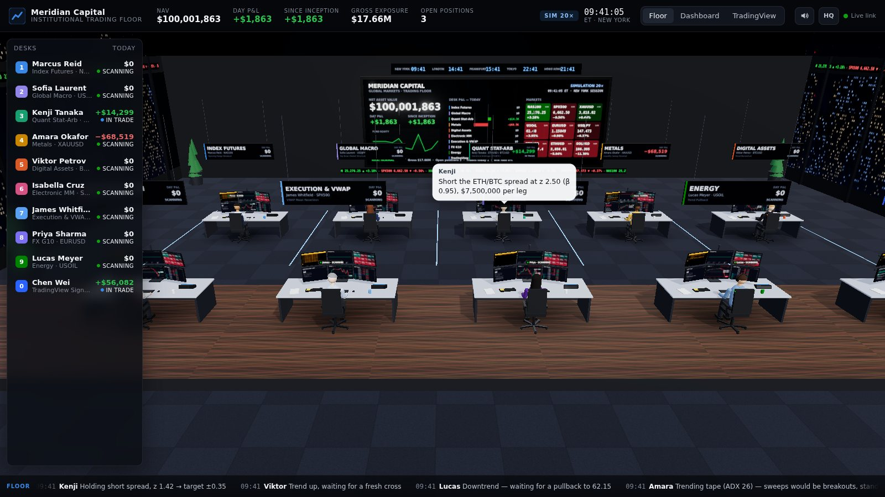
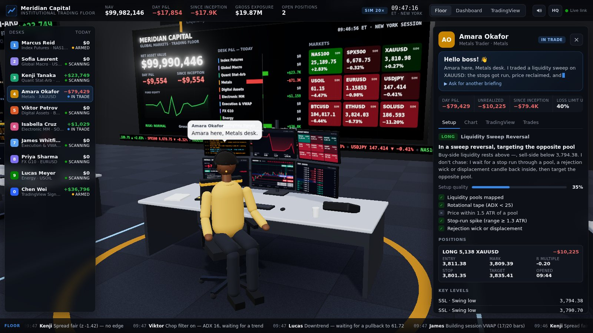
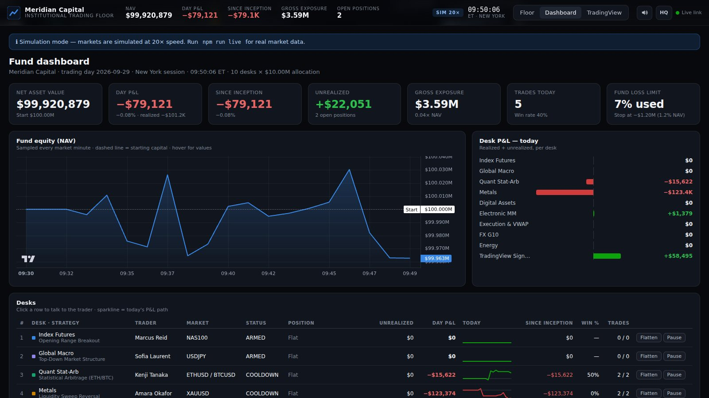
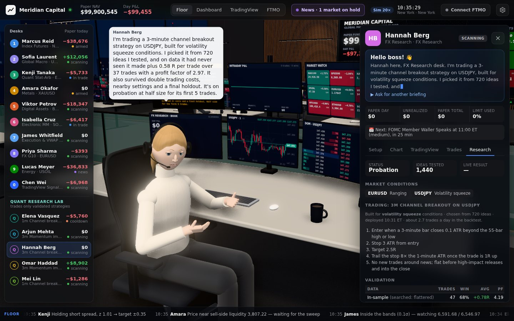
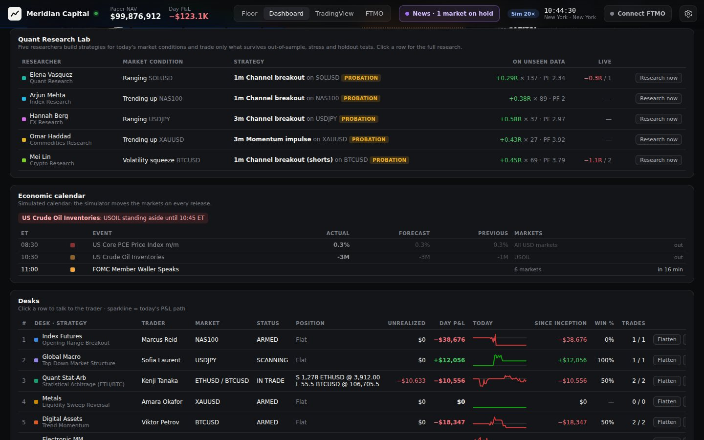
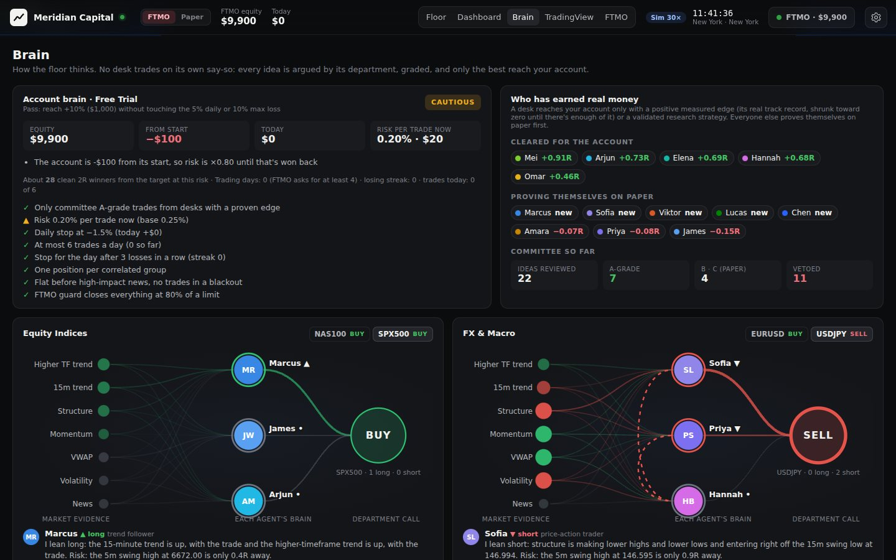
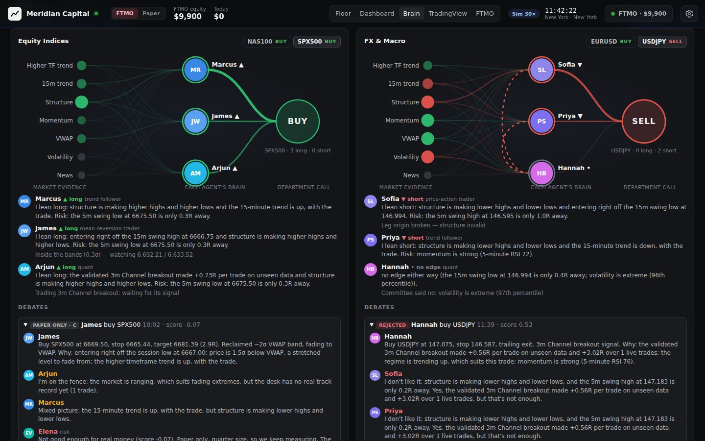
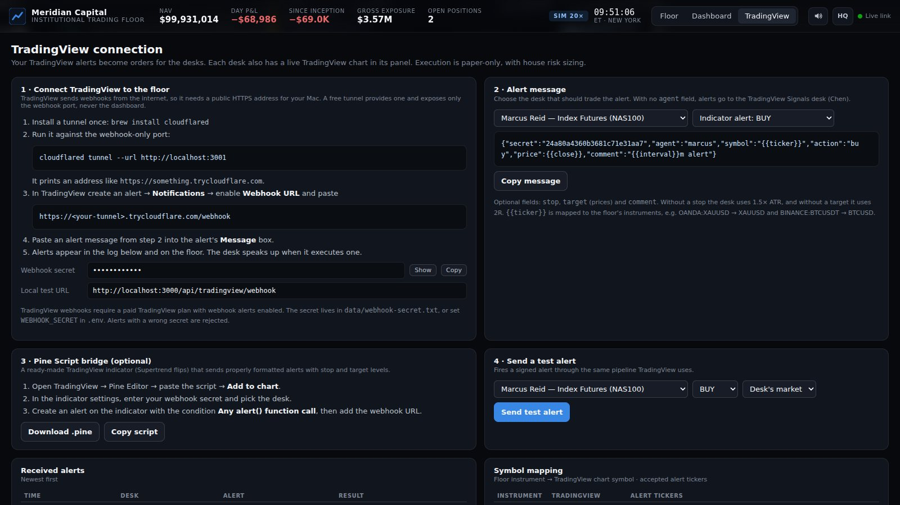
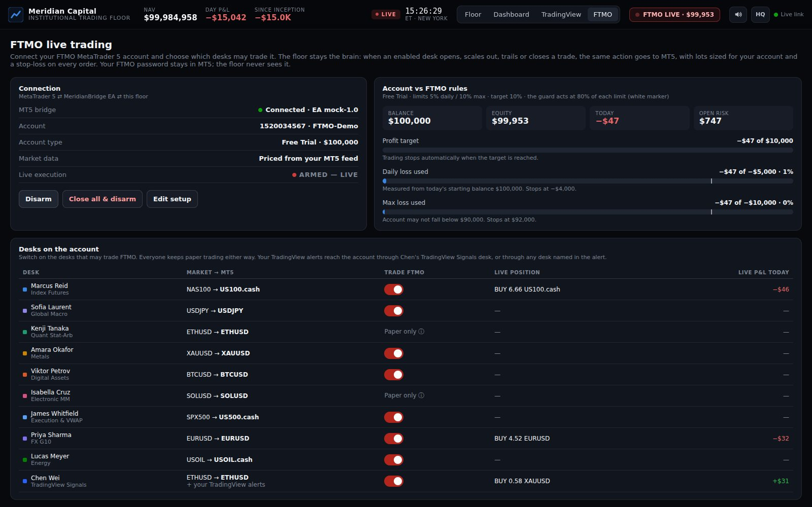
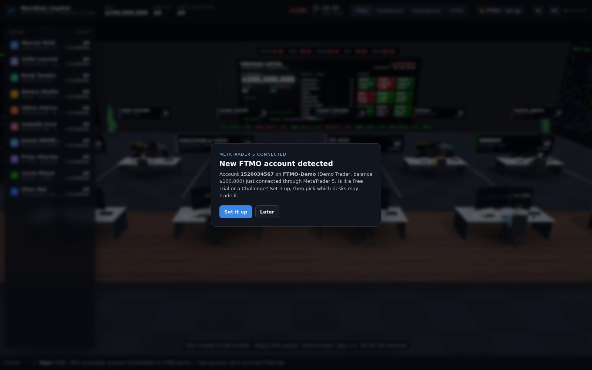

# Meridian Trading Floor

A 3D institutional trading floor that runs in your browser, served by a small server on your Mac. Twenty AI agents work the floor. Ten trading desks each run their own strategy and day-trade like an institutional book. A five-person **Quant Research Lab** builds strategies for the market's current conditions, backtests and validates them, and trades only what survives. A five-person **Scalping Desk** only takes fast trades, scalping the London and New York sessions the way AJ Currency trades: liquidity first, tight stops. Every desk respects the **economic calendar**: no new trades into big news, and flat before it. No desk trades on its own say-so: every trade idea is **argued by its department** and graded, and an **account brain** decides what, if anything, reaches your prop account. You watch them live at their multi-monitor workstations, click one to zoom in, and they turn around and say **"Hello boss!"**, then walk you through their current setup and P&L out loud.



| Click a trader → "Hello boss!" | Fund dashboard |
| --- | --- |
|  |  |

> **Paper trading by default.** Real orders only happen on a MetaTrader 5 account (such as your FTMO Free Trial or Challenge) that you connect **and** arm yourself in the FTMO tab. This is a learning tool, not financial advice, and automated trading can lose money.

---

## Quick start (Mac)

1. Install **Node.js 18 or newer**, either from <https://nodejs.org> (LTS) or with `brew install node`.
2. Get the code and start it:

   ```bash
   git clone https://github.com/IliasK151/Cloud.git trading-floor
   cd trading-floor
   npm install
   npm start          # live market data
   # or
   npm run demo       # simulated markets at 20× speed, works offline
   ```

3. Your browser opens **http://localhost:3000**. That's the floor. The first time, a short welcome walks you through it: what you're looking at, how the traders should sound, and (optionally) connecting FTMO.

**Prefer double-clicking?** Open the folder in Finder and double-click **`start.command`** (live) or **`start-demo.command`** (simulation). If Node.js is missing it opens the download page for you; otherwise it installs everything on the first run, starts the server and opens your browser. Close the window or press `Ctrl+C` to stop. The desks flatten and the track record is saved to `data/`.

### Live vs demo

| | `npm start` (live) | `npm run demo` (simulation) |
| --- | --- | --- |
| Crypto (BTC, ETH, SOL) | Binance public market data, real time | Simulated |
| Index futures, gold, oil, FX | Yahoo Finance 1-minute bars (NQ, ES, GC, CL, EURUSD, GBPUSD, USDJPY) | Simulated |
| Clock | Real time; desks go flat 16:50–18:00 New York | 20× accelerated New York session, 09:30–16:00, then the next day |
| Best for | Watching the agents trade the real market | Non-stop action, weekends, offline |

**Live mode uses real prices only. Nothing is ever simulated.** If a market's live source can't be reached, that market has no prices (`WAITING`) until real ones arrive: its desks show **NO PRICES**, stand aside, say why in their briefing, and refuse TradingView alerts on it. No paper trades, no research on made-up history. Every price is labelled `LIVE`, `DELAYED`, `CLOSED` or `WAITING`, so you always know what you're looking at. Futures and FX desks go quiet on weekends in live mode, while crypto trades 24/7. (`npm run demo` is the only place prices are simulated.)

**"Yahoo … HTTP 429" at startup.** Yahoo Finance rate-limits some internet connections. The floor handles this politely:

- it opens a browser-like session;
- it sends one request at a time;
- after a 429 it pauses instead of retrying.

In the meantime those markets wait, with no prices. The floor keeps retrying in the background (Yahoo, and Binance for the coins), after about 1½, 3 and 6 minutes and then every 10 minutes, and each market gets real prices the moment its feed answers. With MT5 connected and the account set up in the FTMO tab, it doesn't matter: every mapped market (NAS100, SPX500, gold, oil, EURUSD, GBPUSD, USDJPY and the coins your broker lists) runs on **your broker's own prices** instead. It also gets about 6,000 of the broker's one-minute bars as research history. A market added to the floor after you set up the account (like GBPUSD) is mapped to your broker's symbol automatically on the next sync.

---

## The floor

- **A calm, modern floor:** polished concrete, walnut slat walls, linear pendants over every desk and floor-to-ceiling windows onto the city at dusk, with soft shadows and ambient occlusion.
- **20 desks in four tiers**: two trading rows; raised behind a glass rail, the Quant Research Lab; and at the very back, a step higher, the Scalping Desk. Each desk has a six-screen workstation. The screens are live: a TradingView-style chart with the desk's entry, stop and target drawn as a position box, the book and setup checklist, a DOM ladder with time & sales, a Bloomberg-style terminal with the desk's log, the intraday P&L curve, and market watch.
- **A name tag floats over every desk** with the trader, their desk, today's P&L and a status dot (scanning, armed, in trade, standing aside for news, researching, halted). Click it to talk to them.
- **The front wall** carries the LED video wall (NAV, day P&L, fund equity, the next market-moving news, desk P&L bars, markets), world clocks and a ticker tape.
- **The traders are real characters,** each with their own look: faces with eyes that blink and follow what they're reading, hairstyles, suits, blazers and knitwear, glasses and trading headsets. Their hands work the keyboard and mouse (the arms use inverse kinematics), and between trades they sit back to read, rest their chin on a hand, take calls on the headset or sip their coffee. They fist-pump a winner, put their hands on their head after a loser and slump when risk halts them. When they trade, a speech bubble pops up over their head.

**Controls:** click a trader, or press keys `1`–`0` for the ten trading desks, to zoom in (the research lab is marked `Q`: click them or use the arrow keys). Drag to orbit, scroll to zoom, right-drag to pan. `←`/`→` moves to the next trader, and `Esc` returns to the overview. `D` opens the dashboard, `B` the Brain, `T` the TradingView page, `L` the FTMO tab, `F` the floor. `V` turns voices on and off, and `Q` switches graphics quality. The gear icon (top right) holds the voice and graphics settings and can replay the welcome tour.

### "Hello boss!"

Selecting a trader flies the camera to their desk. They swivel their chair toward you, wave, and give a live briefing: their strategy, the current setup and key levels, any open position with stop, target and R-multiple, and their P&L for the day and since inception. The briefing is spoken aloud, each trader has their own voice, and their lips move with the words. The side panel shows the full setup checklist, levels, positions, performance, a live chart, the real **TradingView** chart for their market, and their trade history. From the panel you can also **flatten** or **pause** the desk.

### Voices

Choose how the traders sound in the welcome tour or under the gear icon:

- **Realistic** (recommended): natural, human-sounding AI voices from [Kokoro](https://huggingface.co/hexgrad/Kokoro-82M), an open (Apache-2.0) text-to-speech model. The floor's own server runs it on your Mac, in the background, so it works the same in Chrome and Safari. The first time you pick it, the floor installs its voice engine into `data/voice-engine` (about 400 MB, a minute or two) and downloads the voice model once from Hugging Face (about 90 MB); after that it starts in seconds, even offline. Progress shows under the gear icon and in the Terminal (lines starting with `[voices]`). Nothing you hear is sent anywhere. Mac voices fill in until it's ready, and if a sentence ever fails, the trader finishes in their Mac voice rather than going quiet; the gear icon says what went wrong.
- **Mac voices:** your computer's built-in voices. The floor picks the best installed English voices, matches each trader's gender and accent, gives everyone a different voice where it can, and never uses the novelty or old robotic ones. For much better Mac voices, open **System Settings → Accessibility → Spoken Content → System voice → Manage Voices** and download a few **Premium** or **Enhanced** voices (for example Zoe, Ava, Evan, Nathan, Serena or Daniel), then reload the floor.
- **Off:** traders answer in text only.

Tickers are read the way traders say them ("gold", "the Nasdaq", "dollar yen"), and P&L and R-multiples are spoken properly.

---

## The desks

| # | Trader | Desk | Market | Strategy |
| --- | --- | --- | --- | --- |
| 1 | Marcus Reid | Index Futures | NAS100 | **Opening Range Breakout**: marks the first 15 minutes of the London and New York opens and trades a volume-confirmed break, with the stop at the range midpoint |
| 2 | Sofia Laurent | Global Macro | USDJPY | **Top-down market structure**: 15-minute HH/HL bias, waits for a pullback into discount or premium, enters on a 1-minute break of structure |
| 3 | Kenji Tanaka | Quant Stat-Arb | ETH / BTC | **Statistical arbitrage**: rolling OLS hedge ratio, trades the spread z-score (±2 in, ±0.35 out), market-neutral |
| 4 | Amara Okafor | Metals | XAUUSD | **Liquidity sweep reversal**: maps resting liquidity at swing and session highs/lows, fades stop-run spikes that reject back inside |
| 5 | Viktor Petrov | Digital Assets | BTCUSD | **Trend momentum**: EMA 9/21 crosses with an EMA 50 filter and ADX confirmation, trailing chandelier stop |
| 6 | Isabella Cruz | Electronic MM | SOLUSD | **Market making**: two-sided quotes in clips, inventory skew, toxic-flow filter and an inventory stop |
| 7 | James Whitfield | Execution & VWAP | SPX500 | **VWAP mean reversion**: fades ±2σ session-VWAP stretches back to VWAP when the tape is rotational |
| 8 | Priya Sharma | FX G10 | EURUSD | **Volatility squeeze**: Bollinger inside Keltner for 6+ bars, trades the release with momentum |
| 9 | Lucas Meyer | Energy | USOIL | **Trend pullback**: buys dips to the EMA 20 in an EMA 20/50 uptrend after an RSI reset (and the mirror for shorts) |
| 0 | Chen Wei | TradingView Signals | ETHUSD + any | **Executes your TradingView alerts**, and runs Supertrend (10, 3) on ETH between alerts |

**The Quant Research Lab** (the raised back row, marked `Q`):

| Researcher | Desk | Researches |
| --- | --- | --- |
| Elena Vasquez | Head of Quant Research | All nine markets, and deploys where the team isn't already trading |
| Arjun Mehta | Index Research | NAS100, SPX500 |
| Hannah Berg | FX Research | EURUSD, USDJPY |
| Omar Haddad | Commodities Research | XAUUSD, USOIL |
| Mei Lin | Crypto Research | BTCUSD, ETHUSD, SOLUSD |

**The Scalping Desk** (the top tier at the back, marked `S`): five scalpers who only take fast trades, all with the same method, modelled on how [AJ Currency](https://www.youtube.com/@aj.currency) (Adrian Mudronja) describes his trading in public. He started with smart-money concepts and moved to a purely liquidity-based approach. He reads the higher timeframes for context even though he scalps, trades the London session (his signals come at 8am London) on GBPUSD, EURUSD and gold, and keeps a tight fixed stop (he quotes 20 pips on gold) for a high reward to risk. His exact entry rules aren't public; the rules below are the floor's version of that approach.

| Scalper | Desk | Market | Killzone |
| --- | --- | --- | --- |
| Jake Morrison | Scalping · GBPUSD London | GBPUSD | 07:00–10:00 London |
| Layla Nasser | Scalping · EURUSD London | EURUSD | 07:00–10:00 London |
| Ryan Cole | Scalping · Gold London | XAUUSD | 07:00–10:00 London |
| Mia Torres | Scalping · Gold New York | XAUUSD | 08:00–11:00 New York |
| Nico Rossi | Scalping · Nasdaq New York | NAS100 | 08:00–11:00 New York |

AJ is known for the first three. The Nasdaq desk applies the same method to the New York open, the most popular fast market on FTMO.

How each scalper trades, on the 1-minute chart, inside its killzone only:

1. **Higher timeframe first.** The hourly trend (15-minute while history is short). With it, any pool of liquidity will do; against it, only a run of *major* liquidity (below), and the committee weighs the trend too.
2. **Mark the liquidity.** The Asia range (19:00–02:00 New York), the previous day's high and low, the London range (for the New York desks), the killzone's opening range, equal highs and lows, and 5- and 1-minute swing highs and lows. The first four are major.
3. **The run and the trap.** Price trades through a pool (the stops get run), then closes back inside: the breakout traders are trapped.
4. **The shift.** A 1-minute close back through the candle that made the run's extreme, with displacement (a big body, a big range or a fair value gap).
5. **Entry and stop.** The stop goes just beyond the run. If that fits the scalp stop, the desk is in at once. Otherwise it waits up to 8 minutes for the pullback to where the stop fits, and lets it go if price jumps through. **Scalp stop:** 20 pips on gold (AJ's number), 10 on GBPUSD, 8 on EURUSD, 20 points on the Nasdaq, stretched to at most 1.5× the 1-minute ATR when the market is fast. A deeper run is skipped, never chased.
6. **Target and exits.** The liquidity on the other side, at least 2R away (2.5R when there's none within 6R). Half comes off at 1R with the stop to breakeven. Out after 20 minutes if it isn't working (below +0.5R), and after 45 minutes regardless. At most three scalps per killzone.

In demo mode the clock only runs New York's cash session, so there the London scalpers work its first two hours (09:30–11:30) and the New York scalpers 11:00–13:00. On the FTMO account the scalpers follow the same rules as every desk: they need a proven edge (or **Proven desks only** off for half risk), and one position per correlated group, so Jake and Layla share the FX slot and Ryan and Mia the gold one.

### Institutional risk framework

- A **$100M fund** split evenly across the 20 desks ($5M each). Every trade is sized so that a stop-out costs **0.5% of the desk's allocation**, capped at **4× leverage**.
- **Trade management:** half the position is taken off at +1R and the stop moves to breakeven. After that the runner is trailed with an ATR chandelier stop, and some strategies use time stops. The scalpers don't trail: the runner goes for the liquidity target, with a 20-minute time stop and a 45-minute limit.
- **Desk daily loss limit (2%):** when it's hit, the CRO flattens and halts the desk until the next trading day.
- **Fund daily loss limit (1.2% of NAV):** when it's hit, the whole floor goes risk-off.
- **News:** no new trades around high and medium-impact releases for the markets they move, and every desk goes flat 5 minutes before high-impact news (below).
- Other controls: cooldown bars after a loss, daily trade caps, and every desk flat into the close. Execution is modelled with spreads, slippage, commissions and maker rebates. USDJPY P&L is converted from yen.

All limits are configurable in `.env` (copy `.env.example`).

---

## Economic news calendar

Real traders don't open a trade into CPI, payrolls or a Fed decision, and they're flat before the number hits. Neither are the desks.

- **The calendar.** In live mode the floor reads this week's [Forex Factory](https://www.forexfactory.com/calendar) calendar (high, medium and low impact, with forecast and previous), saves it in `data/calendar.json` and refreshes it every few hours. If it can't be reached, the desks stand aside around the usual US release times (08:30 and 10:00 New York, and the Wednesday oil report) rather than trade blind. In demo mode the floor generates a realistic calendar, and the simulator moves the markets when each number comes out: a jump in the direction of the surprise and a burst of volatility that fades.
- **Which markets care.** Each release is matched to the markets it moves: US data moves everything, euro data moves EURUSD, UK data moves GBPUSD, Japanese data moves USDJPY, and the oil inventories report moves oil (as high impact). Crypto reacts only to high-impact US news.
- **What the desks do.** No new trades from **15 minutes before to 15 minutes after** high-impact news for their market, and 5 minutes either side of medium impact. **Every position in a market with high-impact news is closed 5 minutes before the release.** TradingView alerts are held to the same rule. The desk's status turns **NEWS**, and its briefing says what's coming and when it's back.
- **FTMO.** Funded FTMO accounts may not open or close trades within 2 minutes of high-impact news on the affected instrument. Closing 5 minutes early and standing aside for 15 keeps the floor well outside that window, and the live router refuses to send any trade during a blackout.
- **Where to see it.** A pill in the top bar counts down to the next high-impact release (or shows who is standing aside), the dashboard has the full calendar with actual, forecast and previous, and the video wall shows the next release. Under the gear icon you can switch news protection off, or let trades already 1R in profit ride through the release with the stop locked at +0.5R (never on desks trading your FTMO account).

---

## The Quant Research Lab

The five researchers don't come to work with a fixed strategy. Each research round goes like this, for each of their markets:

1. **Read the market.** Classify its condition on 5-minute bars: trending up or down, ranging, a volatility squeeze or volatile.
2. **Generate ideas that suit it.** A few hundred strategies are built from six families (channel breakouts, trend pullbacks, band mean reversion, squeeze breakouts, VWAP reversion and momentum impulses) on 1, 3, 5 and 15-minute charts. Each has a market-condition filter (trend only, range only and so on), a long/short filter, and an exit plan: ATR stop, R target or trailing exit, partial profits and a time stop. Ideas that fit the current condition are tried more often.
3. **In-sample search** on the first 60% of the history, then the best ideas are refined. Every backtest uses the desk's real trade management, with spread, slippage and commission, stop-before-target inside every bar, gaps through stops, news blackouts, the session close, cooldowns and the daily loss limit. The signal code is shared with the live desk: the backtest and the desk compute exactly the same signals (tested bar by bar).
4. **Out-of-sample test** on the next 25%, which the search never saw. The edge has to hold up (positive after costs, profit factor ≥ 1.2, keeping at least 30% of its in-sample edge, limited drawdown).
5. **Robustness:** neighbouring parameter settings must also be profitable, it must survive **double trading costs**, and a **Monte Carlo** reshuffle of its trades must stay profitable with a tolerable worst-case drawdown.
6. **Final holdout:** the last 15%, looked at once. On all the unseen data together, the edge must be **statistically significant** (t ≥ 2) over at least 20 trades.

Only a strategy that passes every gate trades. If nothing passes, the researcher doesn't trade and says so. **Deployed strategies start on probation at half size** until they have 5 live trades and are in profit. After every trade, live results are compared with what validation promised, and the strategy is **retired automatically** if it does clearly worse, or if its drawdown goes beyond anything the Monte Carlo expected. Research runs again when the market's condition changes, every 4 hours of market time (walk-forward on fresh data), and 45 minutes after a round that found nothing.

**How strict is it?** On 200 runs of pure random-walk data, where no real edge exists, the lab wrongly accepted a strategy 5 times (2.5%). Without these gates the same search "found" an edge a third of the time. Probation and the live kill-switch are there to catch the rare lucky strategy cheaply.

**History.** In live mode the lab loads about two weeks of real 1-minute bars (Binance, Yahoo Finance), keeps them in `data/history/` and extends them with every new bar, so research gets better the longer the floor runs. Once MT5 prices a market, the broker's own bars are used, and older history is shifted onto the broker's price level. Only real data is ever saved there. Caches from older versions are ignored because they could contain generated bars. In demo mode the lab generates 30 past sessions with the same simulator and calendar.

| A researcher's Research tab | Lab and economic calendar on the dashboard |
| --- | --- |
|  |  |

**Where to see it.** A researcher's panel has a **Research** tab: the market conditions, the strategy's rules in plain English, in-sample / out-of-sample / holdout results, the equity curve in R across the three periods, every robustness check, the live tracking against expectations, what was rejected and why, and a **Research now** button. The dashboard's **Quant Research Lab** card shows all five at a glance. Research runs in a background thread, so the floor never stutters.

**What this is, honestly.** No process can guarantee winning trades or "no mistakes". Markets change, and a real edge can be small and noisy. This lab makes it hard to fool ourselves: strategies must prove themselves on data they have never seen, survive stress, start small and get retired when they stop working. In demo mode the simulator has real structure (trends, ranges, squeezes), so the lab finds edges often. Real markets are harder, and you should expect it to say "no edge" more often there, which is the point.

---

## The Brain: every trade is argued before it's taken



**Departments.** The twenty agents work in four departments, each covering its markets with at least two traders and a researcher: **Equity Indices** (Marcus, James, Arjun, and Nico from the Scalping Desk), **FX & Macro** (Sofia, Priya, Hannah, Jake, Layla), **Metals & Energy** (Amara, Lucas, Omar, Ryan, Mia) and **Digital Assets** (Viktor, Isabella, Kenji, Chen, Mei). Elena, head of research, chairs every decision as the risk manager. Scalpers review scalps; a trading desk's idea goes to the department's other trading desks.

**The market brain.** One shared, multi-timeframe read of every market that everybody reasons from: the higher-timeframe and 15-minute trend, swing structure (higher highs and lows or not), momentum, distance from session VWAP, the levels that matter (session high/low, prior day, 5 and 15-minute swings, VWAP), the volatility regime, the market condition and the news clock. Each piece of evidence comes with a sentence explaining it.

**Each agent's own brain.** Every agent weighs that evidence their own way: a trend follower lives by the trend, a mean-reversion trader cares about location and hates chasing, a quant trusts measured edge and the regime, and the risk manager watches news, volatility and room. Everyone weighs the **measured edge** first: the desk's real track record, shrunk toward zero until there's enough of it (for a research desk, its validated results). The same market therefore gets genuinely different opinions.

**The debate.** When a desk wants to trade, it pitches the idea with its thesis, entry, stop, target and the evidence behind it. Two colleagues from the department that covers the market answer honestly ("Not here: price is 2.9σ below VWAP, which is chasing, and the swing low is only 0.4R away"), and Elena decides. You can watch it: the debate plays out in speech bubbles on the floor, and live in the **Brain** tab.

**The decision.**
- **Vetoed, never traded:** high-impact news within 45 minutes (medium within 20), extreme or dead-quiet volatility, or a target smaller than the risk.
- **A-grade:** full size, and the only grade that can reach your prop account.
- **B-grade:** smaller, paper only.
- **C-grade:** the committee isn't convinced, so a quarter size on paper only, just to keep measuring. That's how a desk earns its way back.

Every trade keeps its thesis and grade: in the trader's Trades tab, the FTMO blotter and the briefing ("Why I'm in: …").

**Does the logic actually help? It was tested, not assumed.** Every rule was checked against simulated trades before it was kept:
- Entries shortly before news averaged −0.30R.
- Entries in extreme volatility averaged −0.24R.
- Entries in a dead-quiet market averaged −0.21R.
- Everything else averaged −0.05R.

Rules that only *sound* smart were left out. "Always trade with the hourly trend" and "only with 1R of room" made no measurable difference, so they stay as opinions and never block a trade. With the committee switched on, across 72 simulated sessions on nine random seeds:
- The fund's worst drawdown was **29–36% smaller**.
- Fund profit was **18–62% higher**.
- A-grade trades averaged about **+0.07 to +0.08R** each.

Run `npm run backtest -- 5` to fast-forward five sessions and see the results yourself.

**The live brain.** The **Brain** tab shows each department as a live graph. The market evidence (green bullish, red bearish) feeds each agent's own brain, and each brain feeds the department's call (BUY, SELL or WAIT). Beneath the graph are every agent's current thinking in plain English and the latest debates, with lines lighting up between agents while they argue. A trader's panel has a **Brain** tab too: what they weigh, how their market looks to them right now, their measured edge and the debates they took part in.



## Protecting the prop account (the account brain)

The paper desks can experiment; the account only gets the best ideas, sized by where the account stands. This is the plan a professional prop trader follows to pass a challenge and keep getting paid:

- **Only A-grade trades from proven desks.** A desk needs 10+ paper trades **on real market prices** and a positive measured edge before it risks real money. For a research desk, a strategy validated on real history counts instead. Demo-mode trades never count, and live mode never simulates a market: one without real prices simply isn't traded. The Brain tab lists who is cleared and who is still proving themselves.
- **Your own TradingView alerts are your decision.** They go to the account without the proven-desk and grade checks. The committee can still veto them (news, extreme volatility, poor reward), and every risk rule below applies. Test alerts from the TradingView tab's button never trade the account.
- **Switched on is not the same as trading.** A desk's own trades reach MT5 only once it's cleared. Everywhere the floor shows where each desk really stands, and never claims a paper trade is on FTMO:
  - desk list chips: **FTMO LIVE**, **FTMO**, or **FTMO · PAPER** while it's proving itself;
  - the "Status on the account" column in the FTMO tab;
  - the dashboard;
  - the desk's own briefing, which gives the reason when a trade wasn't sent.
- **Starting fresh.** The real-only record began with this version. Your desks' earlier paper records can't be split into real and simulated trades, so every desk earns its 10 real trades again before it risks the account. Crypto desks on Binance get there fastest.
- **Drawdown shrinks risk.** Below the starting balance, risk scales down (for example −$100 on a $10,000 trial: 0.25% → 0.20% per trade) until the loss is won back. It never grows past the base risk you set.
- **Daily stop at −1.5%**, far before FTMO's 5%. At half of that, risk halves for the rest of the day.
- **Losing streaks:** two in a row halve the risk until the next winner; three in a row end the day.
- **At most 6 trades a day.** Overtrading is how accounts die. Only trades MT5 actually confirmed count; an order it never confirmed doesn't.
- **Every rule that can hold trades back has its own switch** on the Brain and FTMO tabs, for when you want to let the desks run and watch the performance:
  - **Daily stop:** when it's off, desks keep trading after −1.5%. Risk still halves.
  - **Trade cap:** when it's off, there's no daily limit on trades.
  - **Losing-streak stop:** when it's off, desks keep trading after 3 losses in a row. Risk still halves after 2.
  - **Proven desks only:** when it's off, unproven desks send their committee-approved A and B-grade trades to the account at half risk.

  FTMO's own loss guard (80% of each limit) always stays on.

  While switched-on desks are still proving themselves, the desk list and the FTMO tab say so, with a **Let them trade FTMO now (half risk)** button. The desk chips show where each desk stands:
  - **PROVING**: its trades stay on paper;
  - **FTMO ½**: unproven, trades the account at half risk;
  - **FTMO**: cleared;
  - **FTMO LIVE**: has a position on MT5 right now.
- **The broker's minimum lot.** When a trade sizes below MT5's minimum lot, it goes at the minimum only if that still risks no more than your base risk per trade. Otherwise it stays on paper and says why.
- **One position per correlated group.** NAS100 and SPX500 are one bet, EURUSD, GBPUSD and USDJPY are one FX bet, and so are the three coins.
- **Near the target, smaller risk**, so one loss can't undo the progress. **Funded accounts trade 20% lighter** to protect the payouts.
- The FTMO rule guard, news blackouts and stop-losses on every order still apply underneath.

The Brain tab shows the account's phase and goal, its status (NORMAL, CAUTIOUS or STOPPED FOR TODAY), the risk per trade right now and why, how many clean 2R winners it is from the target, trading days (FTMO asks for at least 4) and every rule. All of it is editable under **Edit setup → The account plan** in the FTMO tab.

To rehearse a drawdown without risking anything, use **two Terminal windows**, because the floor has to keep running while the mock connects to it:

```bash
# Terminal window 1: start the floor and leave it running
cd ~/Desktop/trading-floor && npm start

# Terminal window 2 (⌘N in Terminal): a pretend FTMO terminal that is $100 down
cd ~/Desktop/trading-floor && MOCK_PNL=-100 npm run mock-mt5
```

Close your real MT5 first (or use another floor port), so two terminals don't feed the same floor. `npm run demo` in window 1 works too, but the FTMO tab only arms in live mode.

**Honestly:** none of this can guarantee a pass or a payout. What it does is make every trade explain itself, keep the account out of the situations that measurably lose, and size the account down exactly when losses tempt people to size up.

---

## TradingView integration

1. **Charts.** Every trader's panel has a **TradingView** tab with the official TradingView Advanced Chart for their market (for example `OANDA:XAUUSD` or `BINANCE:BTCUSDT`), plus an "Open on TradingView" link. The floor's own charts are drawn with TradingView Lightweight Charts™.
2. **Alerts → orders.** Your TradingView alerts can be sent to any desk. They trade on paper, and on your FTMO account too for desks you've switched on and armed in the FTMO tab.

### Set up TradingView alerts (about 3 minutes)

Open the **TradingView** tab. A checklist at the top ticks itself off as you go:

1. **Public address.** TradingView sends alerts from its servers on the internet, so the floor needs a public web address. Press **Create public address**. The floor opens a free [Cloudflare quick tunnel](https://developers.cloudflare.com/cloudflare-one/connections/connect-networks/do-more-with-tunnels/trycloudflare/) (no account needed). The first time, it downloads Cloudflare's `cloudflared` app from Cloudflare's official GitHub releases into `data/bin`, unless you already have it (`brew install cloudflared`). The tunnel only reaches the webhook-only port, so the dashboard and its controls stay private on your Mac. It turns itself back on whenever you start the floor.
2. **Connection test.** The floor sends a harmless test ping through the public address to check that it works from the internet. The ping never places a trade.
3. **Alert in TradingView.** Create an alert, paste the **message** the tab writes for you (pick the desk and buy / sell / close / strategy) into the alert's Message box, then tick **Webhook URL** under Notifications and paste the address. This step ticks itself off when the first alert arrives.

Webhook alerts need a paid TradingView plan (Essential or higher), and TradingView asks you to turn on two-factor authentication before it will send them.

**An address that never changes.** The free Cloudflare address changes each time the floor starts, so you'd have to update the Webhook URL in your alerts after every restart (the tab warns you when that happens). For a permanent address, sign up for a free [ngrok](https://ngrok.com) account and paste your **authtoken** and free **static domain** under *Want an address that never changes?* in the tab. That's set once (the token stays on your Mac in `data/tradingview.json`), and the address stays the same for good.

**The alert message** looks like this (the tab fills in your secret):

```json
{"secret":"<your secret>","agent":"amara","symbol":"{{ticker}}","action":"buy","price":{{close}}}
```

- `action`: `buy` / `sell` / `close`. Strategy alerts also work with `"action":"{{strategy.order.action}}","position":"{{strategy.market_position}}"`.
- Optional fields: `stop`, `target` and `comment`. Without them the desk uses a 1.5 ATR stop and a 2R target, sized by the risk desk.
- `agent` picks the desk (`marcus`, `sofia`, `kenji`, `amara`, `viktor`, `isabella`, `james`, `priya`, `lucas`, `chen`). Without it, the alert goes to Chen's TradingView Signals desk.
- Tickers such as `OANDA:XAUUSD`, `NQ1!`, `BINANCE:BTCUSDT` and `ES1!` are mapped automatically.
- The secret is created on first run in `data/webhook-secret.txt`, or you can set `WEBHOOK_SECRET` yourself. Alerts with a wrong secret are rejected, and the endpoint is rate-limited.

**No indicator of your own?** [`tradingview/institutional_agents_alerts.pine`](tradingview/institutional_agents_alerts.pine) is a ready-made indicator that sends Supertrend-flip alerts with stop and target levels to the desk you choose. The tab has **Copy script** and step-by-step instructions.

You can try the whole pipeline without TradingView using **Send test alert** on the tab. Prefer your own tunnel? Point any HTTPS tunnel at `http://localhost:3001` and use `https://<your-address>/webhook`.



---

## How the desks learn

Every desk studies its own trades and gets better at avoiding its own mistakes. The pair-trading and market-making desks manage their books as a whole, so they sit this out.

**What each trade teaches.** When a trade closes, the desk journals the situation it was taken in and how it played out:

- **The situation:** time of day (Asia, London, the New York open, midday, afternoon), whether the market was quiet or wild, with or against the trend, how good the setup looked, whether it came right after a loss, which trade of the day it was, and long or short.
- **How it played out:** the result in R, how far it went for and against the desk, and, after a stop-out, whether the market then went the desk's way.

**What the desk changes**, only when the evidence is clear and always within safe limits:

- **Sizing.** A bit bigger where the desk has a proven edge, and smaller in situations that do worse than its other trades, or while it's in a losing streak (×0.5 to ×1.25 overall).
- **Sitting out** a situation that keeps losing compared with the desk's other trades, after at least a dozen trades of evidence. The desk still takes an occasional small test trade there, so it can notice when things change and go back.
- **Fixing management mistakes:**
  - Giving back winners → it takes partial profits sooner and trails tighter.
  - Getting stopped out right before the move → it gives trades more room. The size shrinks, so the money at risk stays the same.
  - Stops wider than needed → it tightens them.
  - Targets that are rarely reached → it brings them closer.
- **Behaviour:** a longer break after a loss if revenge trades lose, and fewer trades per day if late-day trades lose.
- **Checking its own changes.** After about 15 more trades, the desk compares results before and after each change. It keeps what helped and rolls back what didn't, and tells you so.

**Where to see it.** Each trader's panel has a **Learning** tab: what they do differently now, every lesson with its evidence, and their results in each situation. New lessons pop up on the floor, traders mention the latest one in their briefing, and the dashboard lists what every desk has learned. Everything is saved with the track record and survives restarts. **Forget what they learned** in the tab starts a desk fresh.

**Safety.** On your FTMO account, learning can only make a trade smaller, never bigger, and every FTMO rule and limit still applies. Your own TradingView alerts are studied but never skipped or changed. This is adaptive risk management from a desk's own history, not a guarantee of profits: patterns from a few dozen trades can be noise, which is why every change is limited, reviewed and reversible.

---

## Trade your FTMO account (MetaTrader 5)

The desks can trade your **FTMO Free Trial, Challenge, Verification or FTMO Account** through MetaTrader 5. A small Expert Advisor, [`mt5/MeridianBridge.mq5`](mt5/MeridianBridge.mq5), runs inside your MT5 terminal and links it to the floor on the same Mac. Your FTMO password stays in MT5; the floor never sees it.



**How it works**

- **The floor stays the brain.** When a desk you've enabled opens, scales out, moves its stop or closes a trade, the same action is sent to MT5.
- **Every order carries a stop-loss.** Positions stay protected in MT5 even if the floor, the EA or your Mac stops.
- **Your own risk sizing, not the paper desk's.** The default is **0.25% of balance per trade**, with at most 1.5% open risk and 5 live positions, all editable.
- **Priced from MT5.** Once connected, the floor switches each mapped market to your broker's prices (US100.cash, XAUUSD, EURUSD and so on). The desks then analyse exactly the prices they trade.
- **Your TradingView alerts can trade the account too.** Enable Chen's TradingView Signals desk (or any desk named in the alert). Each alert is debated by the committee like any other idea and executed on FTMO with the same sizing and stop rules (only A-grade alerts reach the account).
- **FTMO rule guard.** It watches the daily and maximum loss using FTMO's method (equity against the day's starting balance, and against the account size). At 80% of a limit it closes the floor's positions and stops trading: until the next server day for the daily limit, and until you clear it for the max loss. It can also stop when the profit target is hit, which is on by default.
- **Arming is always your decision.** The floor starts disarmed after every restart. Paid accounts need you to type the account number to arm. **Close all & disarm** is always one click away.
- **Two desks stay paper-only.** The stat-arb and market-making desks don't mirror onto a single prop account.
- **Research desks can trade it too,** once you switch them on: they trade only validated strategies, at half size while a new strategy is on probation.
- **The account brain decides what reaches the account** (above): only committee A-grade trades from desks with a proven edge, sized down in drawdown and after losses, with a daily stop, a daily trade cap and one position per correlated group.
- **News.** Nothing is sent to MT5 inside a news blackout, and the floor's positions are closed 5 minutes before high-impact news.

**Set it up (once, about 5 minutes)**

1. Start the floor with `npm start` (live mode; demo mode never trades live).
2. In the FTMO Client Area, start a **Free Trial** on **MetaTrader 5**. Install MT5 and log in with the credentials FTMO shows you.
3. In MT5, go to **Tools → Options → Expert Advisors**. Tick **Allow algorithmic trading** and **Allow WebRequest for listed URL**, then add `http://127.0.0.1:3000`.
4. Install the **MeridianBridge** Expert Advisor. On a Mac, MT5's folders usually don't accept drag-and-drop from Finder, so use one of these:
   - **MetaEditor (easiest):** in MT5 press **F4**, then **File → New → Expert Advisor (template)** and name it `MeridianBridge`. Delete the template code, click **Copy EA code** in the floor's FTMO tab, paste it in (Cmd+V, or Ctrl+V / right-click → Paste) and press **Compile**.
   - **One command:** quit MT5 and run `npm run install-ea` in the trading-floor folder. It finds MT5's hidden `MQL5/Experts` folder and copies the file in. Reopen MT5, right-click **Expert Advisors → Refresh** in the Navigator, then right-click MeridianBridge → **Modify** → **Compile**.
5. Drag **MeridianBridge** onto any chart. Paste the **bridge token** from the FTMO tab into the inputs, tick **Allow Algo Trading**, and switch on **Algo Trading** in the toolbar.
6. The floor pops up **"New FTMO account detected"**. Pick the account type (Free Trial, Challenge, Verification or FTMO Account), check the limits against your Client Area, and save.
7. Switch on the desks that may trade the account, then press **Arm live trading**.



**Which P&L you're looking at.** Every desk also keeps paper trading with the fund's practice money, which runs to millions per desk. Once an FTMO account is connected, the top bar, desk list, desk signs, video wall and trader panels show **your FTMO account**: its equity, today's P&L and each desk's P&L on it. A desk that isn't switched on for the account says **paper**. The **FTMO / Paper** switch at the top flips the floor (and the dashboard) back to the paper fund, and the paper dashboard has a **Reset paper P&L** button.

**Why a desk hasn't traded yet.** A desk only trades when its setup appears, and some setups only appear at certain times (the opening-range breakout needs the New York open). No new trades open between 16:50 and 18:00 New York time, around the daily roll-over.

**No MT5 handy?** Run `npm run mock-mt5` in a **second** Terminal window while `npm start` runs in the first. It pretends to be an FTMO Free Trial terminal, so you can try the whole connect → set up → arm → trade flow. ("Floor not reachable" means the floor isn't running in the other window.)

**Before you arm a paid Challenge, read this**

- Run it on the **Free Trial** first and watch it for a few days. The strategies were built and tuned on simulated markets and have no real-money track record.
- **Check FTMO's current rules on algorithmic trading yourself.** FTMO generally allows Expert Advisors but prohibits some trading practices, and their terms change. Complying with them on your account is your responsibility.
- **A stop-loss is not a guarantee.** Gaps, news spikes and slippage can fill beyond it. The guard acts at 80% of each limit to leave a buffer, but it cannot promise you'll never breach one. The floor stands aside for news using a public calendar; FTMO's own list of restricted releases is what counts, so check it for funded accounts.
- MT5 must stay open, and your Mac awake, while the desks trade.

**Troubleshooting**

**Something won't connect? Run `npm run doctor`** in a second Terminal window while the floor runs. It checks:
- the floor itself;
- the dashboard's live feed;
- MT5 (including the exact reason it's being refused, such as a wrong bridge token);
- the TradingView address.

It then prints what to fix. It only reads; it never trades. The FTMO tab shows the same MT5 reason at the top, and the dashboard shows what to do when it loses the floor. After the floor restarts, open dashboard tabs reload themselves.

| MT5 shows… | Fix |
| --- | --- |
| "WebRequest is blocked" (error 4014) | Add `http://127.0.0.1:3000` under Tools → Options → Expert Advisors → Allow WebRequest |
| "Floor not reachable" | Start the floor (`npm start`). On a different port, set the EA's *Floor bridge URL* input to match. MT5 in a Windows VM or on another PC: set `HOST=0.0.0.0` in `.env` and use the Mac's address in the URL |
| "Floor refused the sync (HTTP 401)" | The bridge token is wrong: copy it again from the FTMO tab (it lives in `data/bridge-token.txt`) |
| The FTMO tab says "Algo Trading is off" | Turn on the Algo Trading toolbar button and tick *Allow Algo Trading* in the EA's settings |
| Can't drag the file into the Experts folder | Use the MetaEditor paste method or `npm run install-ea` (step 4 above) |
| A market shows "not mapped" | Pick the matching MT5 symbol in **Edit setup → Symbols on your account** |
| A desk says **NO PRICES** / the FTMO tab says "No real prices for …" | That market's live feed isn't answering (e.g. Yahoo HTTP 429) and nothing is simulated. Map it to your MT5 symbol in **Edit setup** and your broker's prices take over within seconds |

---

## Dashboard

The **Dashboard** tab follows the **FTMO / Paper** switch (in the top bar, or on the dashboard itself once an FTMO account is connected).

- **FTMO account:** equity and balance, today's P&L (from the day's starting balance, FTMO's way), P&L since the start, open P&L and open risk, the floor's trades today and win rate, daily loss used and profit-target progress. Also the account equity curve, each desk's P&L on the account, a desk table with the live MT5 positions, FTMO rule meters, a blotter of the floor's trades on the account and a **Close all & disarm** button.
- **Paper fund:** NAV, day P&L, P&L since inception, unrealized P&L, gross exposure, trades and win rate, the fund equity curve, desk P&L bars, a desk table with sparklines, positions and flatten/pause buttons, loss-limit usage per desk, the trade blotter and floor-wide controls.
- Both show the **Quant Research Lab** (each researcher's market condition, strategy, unseen-data results and live record), the **economic calendar** with who is standing aside, the market board, received TradingView alerts and **what the desks have learned**.

---

## Security

The floor can trade a real account, so it's built like a small trading firm's network. Each layer holds even if another one fails.

**What's reachable from where**

| From | Can reach | Protection |
| --- | --- | --- |
| The internet | Only the TradingView webhook, through the tunnel | The webhook firewall (below) |
| Web pages in your browser | Nothing | Other sites can't read the page, so they never get the floor key |
| Devices on your Wi-Fi | Nothing, unless you set `HOST=0.0.0.0` | Then only the MT5 bridge (its token), and the dashboard only with `FLOOR_PASSWORD` |
| This Mac | The dashboard | Every request carries a floor key that changes each launch |

**The webhook firewall.** This is the only part of the floor on the internet. Every request passes through it in this order:
- Banned addresses are refused. Five wrong secrets from one address means a one-hour ban.
- Flood limits apply per address and overall.
- Bodies are small and treated as data only. Crafted fields are ignored.
- The secret is checked first, in constant time, before anything in the alert is looked at.
- Trade alerts are only accepted from **TradingView's own servers**. The addresses come from TradingView's published list; the tunnel reports the real sender, and outsiders can't fake it. Connection tests work from anywhere.
- If your correct secret arrives from anywhere else, it has leaked. The alert is refused, an alarm shows on the floor, and **Rotate webhook secret** issues a new one in one click.

The **Firewall** card in the TradingView tab shows all of this live, with the security log and the bans. The webhook listener only accepts connections from this Mac, where the tunnel app runs.

**The dashboard.** Every request is checked:
- **Floor key:** every API call and the live feed need the key, which only the dashboard page receives. Cross-site requests are refused, which stops a malicious web page from placing or closing trades.
- **Host check:** only localhost, 127.0.0.1 and this Mac's own names are accepted. This blocks DNS rebinding.
- **Page security headers:** a strict Content-Security-Policy (no inline or third-party scripts), no framing (blocks clickjacking), and no referrer.
- **TradingView chart:** it runs isolated on its own origin, so its code can never see your account.

**MT5 is the last line of defence.** The bridge EA (version 1.1) enforces its own limits, whatever the floor asks for:
- every order needs a stop-loss;
- risk per order is capped (**Max risk per order**, default 1% of balance);
- floor positions are capped (**Max floor positions**, default 8);
- a stop-loss can only be tightened, never removed;
- it only ever touches the floor's own positions, never your manual trades.

While MT5 runs an older EA, the FTMO tab shows an **Update the MT5 bridge EA** box:
1. **Put the update into MT5** copies the new EA into MT5's Expert Advisors folder on this Mac.
2. In MT5's Navigator, right-click **MeridianBridge → Modify**.
3. Press **Compile** in MetaEditor.

MT5 reloads the EA on the chart with your token, and the box turns green. If MT5 runs in Parallels or on another PC, use **Copy EA code** and paste it in MetaEditor instead.

**Secrets:**
- Your FTMO password never leaves MT5.
- The webhook secret, bridge token, account setup and track record live in `data/`. That folder is readable by your macOS user only (0700/0600), and git never commits it.
- The terminal shows only the first characters of the webhook secret.
- The cloudflared download is checked against the SHA-256 checksum published for that release. A mismatched file is deleted and never run.

**What you should do**

- Keep **Trade alerts only from TradingView's servers** on.
- Turn on two-factor authentication for TradingView and FTMO.
- Never share your alert message: it contains the webhook secret. If you think it leaked, rotate it.
- Use `HOST=0.0.0.0` only on your home Wi-Fi, with a strong `FLOOR_PASSWORD`. Wi-Fi access is plain HTTP, so it isn't meant for public networks.
- Keep macOS updated, turn on FileVault (encrypts `data/` on disk) and lock your screen.

`npm test` includes the attacks themselves:
- cross-site trade requests;
- WebSocket hijacking;
- DNS rebinding;
- brute-forced and leaked secrets;
- crafted alerts and oversized bodies;
- a tampered cloudflared download.

Every one of them is refused.

## Configuration

Copy `.env.example` to `.env`. The most useful settings:

| Variable | Default | What it does |
| --- | --- | --- |
| `FEED` | `live` | `live` or `sim` |
| `SIM_SPEED` | `20` | Simulation speed (market seconds per real second) |
| `PORT` / `WEBHOOK_PORT` / `WIDGET_PORT` | `3000` / `3001` / `3002` | Dashboard, webhook-only port (this Mac only, for the tunnel), isolated TradingView chart |
| `HOST` | `127.0.0.1` | Set `0.0.0.0` when MT5 runs in a Windows VM (Parallels) or on another PC: the MT5 bridge becomes reachable on your network (token required) and the dashboard stays on this Mac. Add `FLOOR_PASSWORD` to also open the dashboard from an iPad |
| `FLOOR_PASSWORD` | — | Password for other devices on your Wi-Fi (at least 10 characters). This Mac never needs it |
| `ALLOWED_HOSTS` | — | Extra host names allowed to open the dashboard (comma-separated), e.g. a custom local DNS name |
| `WEBHOOK_SECRET` | auto | TradingView webhook secret (auto: random, in `data/webhook-secret.txt`, rotatable from the TradingView tab) |
| `STARTING_CAPITAL` | `100000000` | Fund size, split evenly across the 20 desks |
| `RISK_PER_TRADE_PCT`, `DESK_DAILY_LOSS_PCT`, `FUND_DAILY_LOSS_PCT`, `MAX_LEVERAGE` | 0.5 / 2 / 1.2 / 4 | Risk framework |

Other commands:

```bash
npm test               # tests: indicators, broker, risk, webhooks, FTMO, news calendar, backtester (no look-ahead),
                       # research validation (rejects pure noise), research desks, committee + account brain,
                       # a full floor session
npm run doctor         # checks every connection (floor, dashboard, MT5, TradingView) and says what to fix
npm run mock-mt5       # pretend FTMO MT5 terminal for trying the live flow (MOCK_PNL=-100 rehearses a drawdown)
npm run install-ea     # copy the MT5 bridge EA into MetaTrader 5 on this Mac
npm run backtest -- 5  # fast-forward 5 simulated sessions (news + research lab included) and print each desk's results
npm run reset          # wipe the saved track record (keeps your webhook secret)
```

## How it's built

```
server/
  index.js              Express + WebSocket server, webhook-only listener, persistence
  market/               Binance + Yahoo live feeds, regime-switching simulator, 1-min bars,
                        indicators, New York session clock, calendar.js (economic news)
  engine/               paper broker, risk manager (CRO), agent base class,
                        11 strategies incl. research desks, fund orchestration, learning.js
  research/             strategy grammar, backtester, walk-forward validation search,
                        long history store, research lab (worker thread)
  brain/                market brain (shared analysis), personas (each agent's own brain),
                        committee (department debates, vetoes, grades, live thoughts)
  tradingview/          alert parsing + authentication, one-click public address (tunnel)
  live/                 MT5 bridge protocol, FTMO rules + guard, account brain, live execution router
  voices/               realistic voices: Kokoro text-to-speech in a worker thread
mt5/                    MeridianBridge.mq5 Expert Advisor for MetaTrader 5
public/
  js/floor/             Three.js floor: room, desks, six-screen workstations,
                        animated traders (avatar/: head, hair, body, IK), video wall, camera
  js/ui/                HUD, trader panel + briefing + learning + research + brain, dashboard,
                        Brain view (live department graphs), economic calendar, TradingView, FTMO
  js/voice.js           voices: realistic (from the server) or system, lip-sync level
tradingview/            Pine Script alert bridge
```

No build step. The server serves ES modules straight to the browser (Three.js, TradingView Lightweight Charts). Everything runs locally, and the track record persists in `data/`.

---

TradingView and Lightweight Charts are trademarks of TradingView, Inc. FTMO is a trademark of FTMO. MetaTrader is a trademark of MetaQuotes. This project is not affiliated with TradingView, FTMO, MetaQuotes, Binance or Yahoo. Market data from free public endpoints may be delayed or unavailable.
